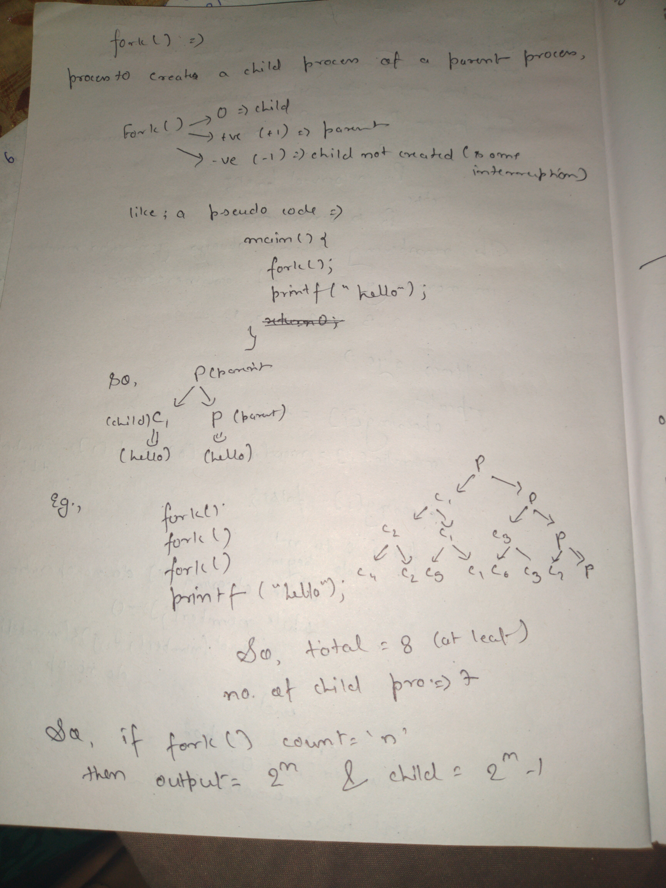
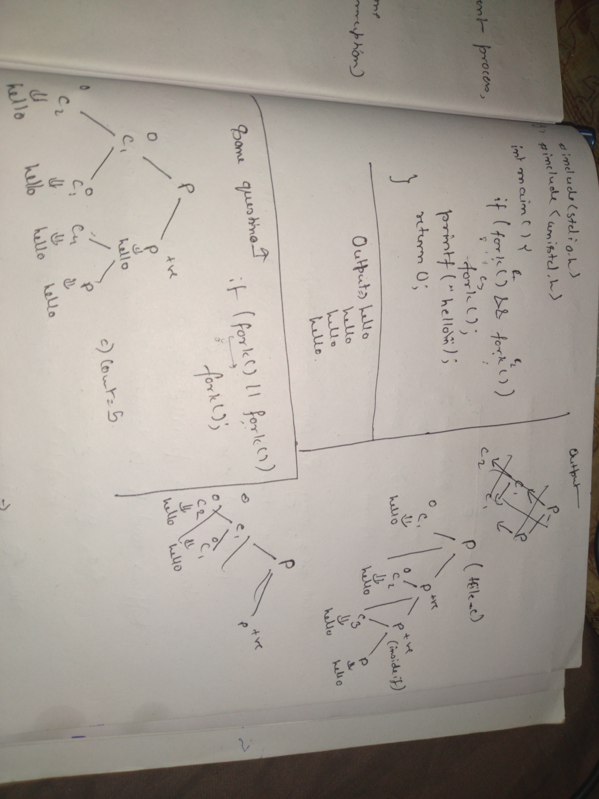
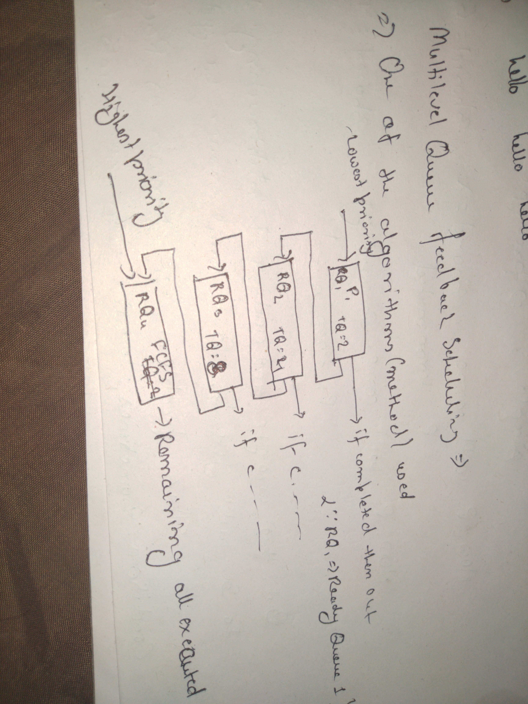
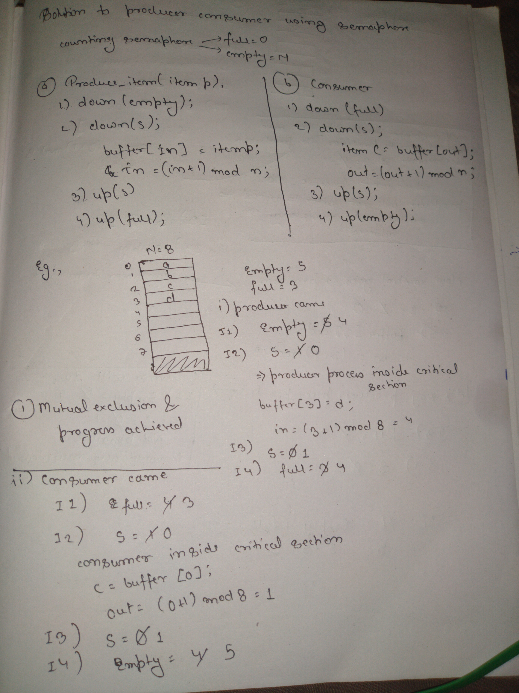
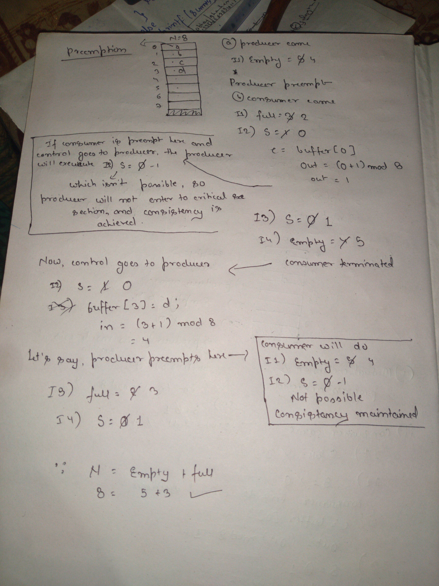

# Some notes on OS basics
---

# Processes vs. Threads

In a broad sense we can say, a process consist of following things(using stack implementation):
* Stack(registers)
* Code
* Datafiles

This comparision is based on **multitasking** processor.
To deal with multiple processes we have to bring concept of multiple CPUs(but it is genarally one)
So, we can create multiple processes or multiple threading for processes.

## Processes

Some points for **Processes** process:

* ***System calls are involved in this process.***
	- Process like `fork()` which are used to clone the main process(create child) to do other task.
	- Basically using kernel(OS) to call fork() to generate a new process to handle the task.
	- This is basically a **kernel-level process**.
* ***OS treats different process differently.***
	- Basically, every process called have a different `PID` with a common `PPID`.
* ***Different process have different copies of*** `data, files & code`.
	- So, a new process will clone everything which is told above of what a process consists.
	- Also, if `n fork()`(cloning process) are called then total ((2*n) - 1) child process will be created.
	- So, there will be total of **2 * n** process.
* ***Context Switching is slower.***
	- So, if a context switching happens from a process to another then it has to save alot of values.
	- These values are stored in `PCBs` with the help of OS which is very much time consuming.
* ***Blocking a process will not block another process.***
	- Let's say, parent process is blocked(maybe due to some I/O demand), so it's in waiting state(block state).
	- At this time, child processes are not blocked. They are running independentely.
	- Same thing for one child process to another.
* ***So, this is independent.***

Here, is explanation of fork:


more on fork()


## Threads

Some points for threads:

* ***There is no system call involved.***
	- So, basically `API`(application program) creates multiple threads(depends).
	- So, this is a **user-level process**.
* ***All user-level threads treated as single task for OS.***
	- So, all threads related to a task have a single `PID`.
* ***All threads of a process(task) share all the `data & code`.***
	- They only have different combinations of stack(registers).
* ***Context Switching is faster.***
	- The only switching which happens here is basically of stack(registers/addresses).
	- This is not very time consuming.
* ***Blocking a thread will block entire process.***
	- Let's say there a three threads _t1, t2 and t3_ in a process.
	- As said, they will share _data & code_ but they will have independent registers.
	- Now, if `t2` demands for I/O, this demand will reach to kernel(OS).
	- So, kernel will block the process, because kernel doesn't knows that this particular process consists of 3 threads.
	- Because, these threads are created as **user-level** not **system-level** process.
* ***Threads are interdependent.***

# Types of Threads:

* User Level Threads
* Kernel Level Threads

## User Level Threads:

* User level threads are managed by the User level library.
	- Like if we are writing a C program and use `pthread.h` which is library for creating threads.
	- So, functionalities like `pthread_create, pthread_join` are user level.
	- Time consumin is very low.
* User level threads are typically fast.
	- These are created by _APIs_, so OS is only responsible for execution and nothing else.
* Context switching is faster.
	- Context switching only happen in stack(registers set) for each thread.
	- As the user-level threads share `code & data.`
	- This doesn't require OS to interfere which makes it faster.
* If one user level threads perform blocking operation then entire process will be blocked.
	- So using different models we tell kernel that we had used multi-threading in this process

## Kernel Level Threads:

* Kernel level threads are managed by OS.
	- These are created using **system calls**
	- This will take more time
* Kernel leve threads are slower.
	- In time consuming meter, this is almost similar to creating a new process(child).
* Context switching is slower.
	- Previously told.
	- We can tell following order for time consuming for context switching:
		+ Processes > Kernel level threads > User level threads
* If one kernel level thread blocked, it doesn't affects others.

# User Mode vs. Kernel Mode:

Let's take an example, suppose I opened a text editor in linux system and typed a program to read a file and write something into it.
Now, data is stored in _storage drive(HDD, SSD etc)_. So, after `user-process executing` a `get system call` will happen.
Like in program `Read()` will happen.

Now, as Read() will happen, a **trap()**(interrupt) is set up. Now, I as soon as we shift from user mode to kernel mode, mode bit changes from **1 to 0**.

Yes, Mode bit for **User mode** is 1.
Mode bit for **Kernel mode** is 0.

Now, system call will be executed and after that we'll come back to user mode, because user works in User mode.
And, also mode bit changes to 1 from 0.

Let's take another example, there's a C program in which it is written to add two number.
Now, this doesn't require kernel to process. But, if wrote `printf()` to show output in monitor, it requires kernel mode.

So, _user mode_ and _kernel mode_ in combination is called **Dual Mode.**

# Multilevel Queue Scheduling

This type of scheduling tells that for each type of process there should be a different **ready queue**.
Before, it we used a single ready queue for all types of process.

The processs could be of following types:
* Highest Priority -> system process(interrupts etc.)
* Medium Priority -> interactive process(movie watching, programming etc.)
* Lowest Priority -> background process

So, every type of process have their own ready queue.

Now, scheduling algorithms could may or may not be different for each type of process.
Like, for above given three types of process, OS could use
* Round Robin
* Shortest Job First
* First Come First Serve

They could be same also. Now, these are feeded to CPU.
Now, there's a problem also. If OS had too many _system processes_, then processes with medium and low priority will _starve_.
Solution could be **Multilevel Feedback Scheduling**.

# Multilevel Feedback Queue Scheduling

As seen above, if lowest priority process gives feedback and OS upgrade it, the starvation could be avoided.

Two things to take care of here:
* Lowest priority process should be upgraded.
* Highest priority process should not be interrupted.

Here's a screenshot to clear out.


# Process Synchronization

In multiprocessing environment, another process should not start till first process is complete.
This is called Process Synchronization.

Process Synchronization mainly deals with two types of process:-
* Co-operative Process
* Independent Process

## Co-Operative Process - 
Processes whose execution affects another process. This happens because of sharing.
They can share _variable, memory(buffer), code, resources(CPU, printers etc.)_.

## Independent Process -
Process whose execution doesn't affects another process. So, it's obvious that they have nothing in common.

# Race Condition:
Here is the image captured explaining race condition:


So, if co-operative process isn't synchronized properly, they can create some problem.

# Critical Section
It is a part of the program a shared resource is accessed by the various process.
These processes are co-operative. Also, these are con-current process.

So, if two concurrent programs have something in common, then those things will be put in critical section.
Non-common things are put in non-critical section.

Critical section is a place where _shared variables, resources_ are placed.

If a program is accessing a critical section then another program should not access it.
If it happens then **Race Condition** will occur. To avoid _race condition_, synchronization is done in these processes in critical section.

Different methods like **Semaphore, monitor, lock-variables etc.**.

So, we define a _entry section_ before critical section in concurrent programs.
If condition satisfies then critical section can be accessed.

There can also be a **exit section** after critical section in concurrent process.

# Synchronization Mechanism

4 conditions for any synchronization method:
* mutual exclusion
* progress
* bounded wait
* No assumption related to hardware or speed

First two rules are mendatory for process synchronization.

Let's there are two process **P1 and P2**. If P1 is in critical section then P2 must not get to entry section.
If this is achieved then **Mutual Exclusion** is achieved.

Let's say, there is not any process executing common code of critical section at give particular time.
That means, critical section is currently empty.
Now, let's say _P1_ is intersted to go into critical section but _P2_ is blocking P1
because P2's entry section may contain such code which code block P1 to access critical section or vice versa
then there isn't **Progress.**
So, _progress_ is must for synchronization.

Now, let's say _P1_ accessed critical section and _P2_ not.
Again _P1_ enters critical section and P2 doesn't, still no problem.
But, if this continuous for **infinite** times, means
> P1 -> infinite		P2 -> 0
then this condition is known as **Unbound Wait** condition.

If, it is like
> p1 -> 10				P2 -> 1
then it is **Bound wait** condition. Means, P2 still gets access of critical section.

Now, let's say someone gave a mechanism which have some conditons like this:
- it'll work on 2 Ghz processor fastly
- it'll require 32bit system.

Then this is not an ideal mechanism to achieve _synchronization_.
All the mechanism should be:
- portable
- cross-plateform
- kind-of universal
- easily portable
- easily modifiable

So, primary conditions for synchronization mechanims are:
- Mutual Exclusion
- Progress

And secondary condtions are
- Bound
- No assumption related to hardware or speed

# Classical Problem Of Synchronization

* Classical problems synchronization:
	* Producer & Consumer(Bounded-Buffer) Problem
	* Printer Spooler Problem
	* Readers and Writers Problem
	* Dining-Philosophers Problem
	* Sleeping Barber Problem

## Producer-Consumer problem

Standard problem for multi-process for process synchronization. It's generated in co-operative processes.

Two types of processes are there:
* Producer process - produce the information
* Consumer process - consume the information produced by producer

* Producer process produces information that is consumed by a Consumer process.
* The information is passed from the Producer to the Consumer via a **buffer**.

Two types of buffers can be used:
* `unbounded-buffer` places no practical limit on the size of the buffer
* `bounded-buffer` assumes that a fixed buffer size

Three things to take care of:
* When the `buffer` is full, no producer process will produce anything.
* When the `buffer` is empty, no consumer process will consume the data.
* No producer or consumer problem should work simultaneous on bounded buffer because buffer size is limited so we have to establish a synchronization between producer and consumer.

We can implement producer-consumer buffer with the `linear` or `circular` queue, with the position of `front` as _producer_ and `rear` as _consumer_.

Two ways to solve:

* **Simple Queue(Shared data):**

```c
# define BUFFER SIZE 8

int buffer [BUFFER SIZE];

int in = 0;  // in points to next free positon
int out = 0;  // out points to first full postion
int Counter = 0;
```
	Counter is incremented every time we(producer) add a new item(data) to the buffer & decremented every time we(consumer) remove one item from the buffer.

**producer problem**
```c
while (True) {
	/* produce an item is nextProduced*/
	produce.item(nextProduced);
	while (counter == BUFFER_SIZE);
	/* do nothing */
	buffer[in] = nextProduced;
	in = (in + 1) % BUFFER_SIZE;
	counter ++;
}
```

**in** is address for empty slot in buffer.

Let's see how **counter++** works in assembly mode.
- load _counter's value_ into a register(let's say _Rp_)
- Increament _Rp_
- load _Rp_ register's value to counter

**Consumer problem**
```c
while (True) {
	while (counter == 0); /* do nothing */
	nextConsumed = buffer[out];
	out = (out + 1) % BUFFER_SIZE;
	counter --;
	/* consume the item in nextConsumed */
	process.item(nextConsumed);
}
```

**out** is address for filled slot in buffer.

Here, also counter will work in same as shown above.

We can see that this problem occurs in co-operative process, because both the program share same buffer(stack)
and **counter** variable.

Let's take a scenerio, where a buffer is half filled and process is going to increment counter but an interruption occurs, then context switching happens and control goes to consumer but when counter is decrementing again context switching occurs, like following flow:

> Producer > I1, I2 > Consumer > I1, I2 > Process > I3 > Consumer > I3

Now, according to this flow, we get value of **counter** 5 with producer, and value of **counter** is 3 by consumer. While, we have 4 in buffer. This leads to **Race Condition**. This happens vice-versa.

So, this is the **Producer Consumer Problem**.

# Printer Spooler Problem
This is a standard problem of process synchronization.
In this, we have a printer in network and several users to access that printer.
Printer is very slow peripheral device.

Spooler is like a program which stores all the data to print in a stack(or other) in sequential manner and then passes one by one.

If process wants to put docuement in spooler directory, then it has to execute these 4 lines of code:
```
* Load Ri, m[in]	// in tells position of empty slots, Ri is register with _i_ index
* Store SD[Ri], "File-name"		// SD -> spooler directory
* Increament Ri
* Store m[in], Ri
```

In case, if two or more co-operative process came to put docuemtn in spooler directory, they'll share _in_ variable.
This also have problem of process synchronization.

Let's say there are two co-operative process _P1 and p2_ to store file _F1.doc and F2.doc_. At current the value of _in_ is 0. Now, take this flow:

> P1 > I1, I2, I3 > P2 > I1, I2, I3, I4 > P1 > I4

Now, _in_ will point to 1, which is correct. But P2 will overwrite the file which P1 had stored before in 0 index.
Above scenerio can happen vice-versa also. It is one of the cases.

So, because of no synchronization, a process lost it's data.

# Semaphore
This is a method to prevent **Race Condition**, which mostly happens in co-operative processes(can happen in others also) which leads to _loss of data, deadlock etc._

**Semaphore** is an integer variable which is used in mutual exclusive manner by various concurrent co-operative process in order to achieve synchronization.

Semaphore is used basically in two types:
* Counting
* Binary

Now, we know _critical section_ contains common code for multiple co-operative processes.
But before accessing _CS_, process have to get through _entry code_ and after _CS_ then _exit section_. After that, process could be terminated.
There are various operations for _entry_ and _exit_ code. They are:

* P(), Down, Wait		// these are synonyms of one another
* V(), Up, Signal, Post, Release

They are are corresponding like P() -> V(), Down -> Up, Wait -> Signal/Post/Release

Now, presently critical section is free. So, to get entry in _CS_ process(P1) has to go to entry section, whose pseudo code is:
```c
Down(Semaphore S) {		// S in semaphore integer
	S value = S value - 1;
	if (S value < 0) {
	Put process (PCB) in suspended list, Sleep();
	}
	else
		return ;
}
```
If a process gets to critical section, it is considered successful, if it goes to block state, then it is considered unscuccessful.

If process has executed entry section and then _CS_, then it has to go through _exit section_, pseudo code is: 
```c
Up(Semaphore S) {
	S value = S value + 1;
	if (S value <= 0) {
		Select a process from suspended list, WakeUp();
	}
}
```


So, basically above metioned method is approach by semaphore to avoid critical section problem.

## Counting Semaphore
In counting semaphore, _integer variable_ varies in between **-ve infinity** to **+ve infinity**.

## Binary Semaphore
In binary semaphore, _integer variable_ varies in between **0 and 1** only.

# Solving Producer Consumer Problem by using Semaphore

We will remove the problem of synchronization which we faced in _Producer Consumer Problem_. Following variables have been taken:

| Semaphore | Variable  | Description         |
| :---:     | :---:     | :---:               |
| Counting  | full = 0  | No. of filled slots |
|           | empty = N | No. of empty slots  |
| Binary    | S = 1     |                     |

Let's say there are two process _P1 and P2_.
So, to get through entry section and to get entry in critical section, producer have to go through following piece of code:
```c
produce_item(itemp);
down(s);
	buffer[in] = itemp;
	in = (in + 1) % N;
up(s);
up(full);
```
and consumer have to go through following:
```c
down(full);
down(s);
	itemC = buffer[out];
	out = (out + 1) % N;
up(s);
up(empty);
```

Conventions are as follow:

| **funtion/variable Notation** | **Use**                          |
| :---:                         | :---:                            |
| up()                          | code for entry section           |
| down()                        | code for exit section            |
| S                             | here denoting binary semaphore   |
|                               | integer variable                 |
| empty                         | count of empty slots in buffer   |
| full                          | count of full slots in buffer    |
| in                            | next empty slot to put data on   |
| out                           | points to first full slot to get |
|                               | data out                         |


Below is the image to solve producer consumer probelm using _semaphore_.


The above method contains no context swtiching.
It's basically a no-preemption method and it's doing synchronization perfectly.
This can be happened vice-versa, means consumer can come first and producer later.

Now, we'll see solution for concurrent(co-operative) process. Synchronization in those types of process is difficult.



We are trying to achieve serialization(synchronization) in concurrent processes.
That was solution of Producer Consumer problem with the use of Semaphore.

# Reader Writer Problem

In our database(computer system), we have two types of user operation perform:
* Reading
* Writing

Let's take an example:
```sh
$ cat file_operations/sample.txt	# this is read operation
  This is sample.txt
  It\'s running on hp 245 g5
  It is a simple text file
  It\'s kernel is Linux
  It\'s OS is manjaro with i3 as WM.
$
$ echo "$USER" >> file_operations/sample.txt	# this is write operation
  This is sample.txt
  It\'s running on hp 245 g5
  It is a simple text file
  It\'s kernel is Linux
  It\'s OS is manjaro with i3 as WM.
  raytracer
```

Multiple users(reader or writer) can use data. But there's a catch, if a _reader_ is reading a data
and a _writer_ comes in same data then this is problem.
So, problems on same data can be seen like:
```
R - W => problem	# R = Reader, W = Writer
W - R => problem
W - W => problem
R - R => no problem
```

These are standard problems of **DBMS**.
We'll use _binary semaphore_ to deal with these three problems. Semaphore because we want to synchronize reader and writer process. 

Here is the pseudo code, _reader_ and _writer_ have to execute before getting inside critical section.
```c
// global variables
int rc = 0;		// read count
semaphore mutex = 1		// binary semaphore variable
semaphore db = 1		// binary semaphore variable

// reader's code for entry section
void Reader(void) {
	while(true) {
		// semaphore operation
		down(mutex);	 
		rc = rc + 1;
		if (rc == 1) {
			down(db);
		}
		up(mutex);

DATABASE	// database, critical section

		// reader's code for exit section
		down(mutex);
		rc = rc - 1;
		if (rc == 0) {
			up(db);
		}
		up(mutex);
		Process data	// do data processing
	}
}

// writer's code for entry and exit section
void Writer(void) {
	while(true) {
		down(db);
		DATABASE	// critical section
		up(db);
	}
}
// I can't understand the use of mutex, code should work fine without it
```
In the above mentioned, `db` is an important _variable_ as it controls the reader and writer if any one of them is inside critical section. Also, in the above solution `R - R`(multiple reader's) can get entry to critical section as it isn't a problem. So, we have achieved synchronization and got a way to deal with **Reader Writer Problem.**

# Dining Philosopher Problem

Like others, **Dining Philosopher Problem** is also a standard problem of Operating System.

## What's this problem?
In this problem, there are 5 `philosophers` around a `dining table` and they all have `fork/spoon/chopstick`(taking fork here). In the center, of table there is a bowl containg `noodle/rice/sphagetti`(taking rice here).


Now, every philosopher is having two states:
* think
* eat

So, they think and then after eat(depends on scenerio, but that's the two thing they'll do). But they have to follow a set of rule in this process. Let's consider there are five philosophers `F0, F1, F2, F3, F4` and so five forks `F0, F1, F2, F3, F4`.
> here 0, 1, 2... are index numbers

These set of rules are given here as pseudo code
```c
void Philosopher(void) {
	while(true) {
		Thinking();
		take-fork(i);	// i is index number for philosopher
		// consider i as left fork of philosopher
		take-fork((i + 1) % N)	// N is total number of philosopher/fork
		// consider this as right fork of philosopher
		EAT();
		put-fork(i);
		put-fork((i + 1) % N);
	}
}
```

### case 1:
Now, according to this code, if philosophers goes one by one to eat then there is no problem. It can be considered as **case 1**.

### case 2:
Let, `P0` after `thinking()` takes fork `F0`, but before taking _right fork_ `F1` process `P1` comes in and takes fork `F1`. Now, till `P1` hadn't put down it's left fork(), `P0` can't eat as it's his right fork.

This condition could go on. Maybe before _P1_ takes right fork _F2_, P2 comes in and takes it left fork _F2_. So, this leads to **Race Condition**.

To avoid this, we will be using _binary semaphore_. We will take an _array_ of semaphore binary integers **S[i]**. Total size of array will be of total count of _philosophers_. All the integers, (here, total 5) _S[0] S[1] S[2] S[3] S[4]_ will be initialized with value **1**.

So, the above pseudo code will be changed like this
```c
void Philosopher(void) {
	while(true) {
		Thinking();
		// entry section
		wait(take-fork(S[i]));	// down operation semaphore
		wait(take-fork(S[(i + 1) % n]));
		// critical section
		EAT();
		// exit section
		signal(put-fork(i));	// up operation semaphore
		signal(put-fork((i + 1) % N));
	}
}
```
Now, we know in binary semaphore we take `1` as _green flag_ and `0` as red flag to process to go on. So, according to above code, if any _S[i]_(generally, it will be the left fork of philosopher) is `0` and since it's binary semaphore integer(value can't be down than 0) then that `philosopher` can't go through `entry section`.

For better understanding, see the table below to see which philosopher is related with which semaphore integer

> Rule is: S[i] and S[(i + 1) % N]

| P0 | S0 | S1 |
| P1 | S1 | S2 |
| P2 | S2 | S3 |
| P3 | S3 | S4 |
| P4 | S4 | S0 |

Now, in mutual exclusion we know that only process can be in _critical section_ at a time. But see this, if `P0` goes in then `P1` can't(S1 will already be 0). Now, if `P2` tries to go in, it can easily go to _CS_. So, we saw that in _dining philosopher_, this is a special case that

`More than a process(philosopher) can enter the critical section but they should be independent(fork/semaphore variable)`.

On the above scenario, `P0` and `P2` are independent, they don't share any common semaphore variable(see table above).

### case 3:

Let's see if deadlock occurs in this problem or not. Visualize the scenario given down:
> Note: relate forks (like F1, F2, ...) to semaphore integers (like S1, S2, ...)

So, consider the follwing scenario. All the semaphore integers are `1` currently means, no philosopher has taken any fork. Now,
* Philosopher 0 comes and takes F0 but is preempted(any reason may be time-quantum or low priority) so can't take F1
* Philosopher 1 and takes it's left fork F1(since it isn't taken by P0 right now) but gets preempted
* P2 comes and takes it's left fork and gets preempted
* P3 comes, takes it's left fork and gets preempted
* P4 comes, takes it's left fork and gets preempted

So, all the process has executed `wait(take-fork(S[i]))` but not `wait(take-fork(S[(i + 1) % n]))`. Now,

* P0 requires right fork F1(S1) but can't. P1 have F1(S1 is already 0).
* P1 requires F2 but can't. P2 have F2.
* P2 requires F3 but cant't. P3 have F3.
* P3 requires F4 but can't. P4 have F4.
* P4 requires F0 but can't. P0 have F0.

So, as you can see here, all the process have a resource and they requires another resource which they can't get(all S[i] is 0 currently). Now, this can't be undone since no S[i] can be done to 1.

So, this is a state of **Deadlock.**

The best solution, we get to avoid this _deadlock_ is if way change the sequence of `take-fork();` for `last philosopher`. Means the table will look something like this


| P0 | S0 | S1 |
| P1 | S1 | S2 |
| P2 | S2 | S3 |
| P3 | S3 | S4 |
| P4 | S0 | S4 |

So, now let's start from begining. All the `S[i]` are `1` currently. Every philosopher, starts to take it's left fork _one-by-one_. So, now visualize this scenerio again

* Philosopher 0 comes and takes F0 but is preempted(any reason may be time-quantum or low priority) so can't take F1
* Philosopher 1 and takes it's left fork F1(since it isn't taken by P0 right now) but gets preempted
* P2 comes and takes it's left fork and gets preempted
* P3 comes, takes it's left fork and gets preempted
* P4 comes and now it tries to take it's right fork(not left) but since it's already takeing by _P0(S0 in already 0)_ P4 will be blocked.

In this way, we can avoid deadlock, now
_P3 can take F4 and eat and after it'll put F3 and F4(put-fork S[i] and put-fork S[(i + 1) % n]). So after P3, both P2 and P4 can eat(if needed) since both are independent._

It's not mendatory, to reverse the sequence of last philosopher. We can reverse the sequence for any one of the philosopher.

So, this was Dining Philosopher Problem.
