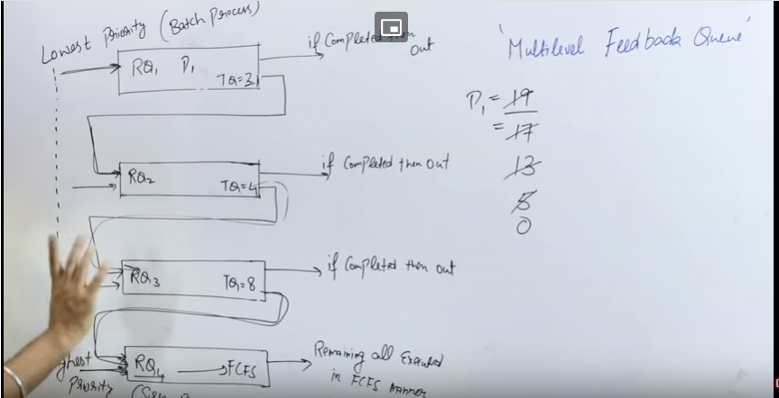

# Some notes on OS basics
---

# Processes vs. Threads

In a broad sense we can say, a process consist of following things(using stack implementation):
* Stack(registers)
* Code
* Datafiles

This comparision is based on **multitasking** processor.
To deal with multiple processes we have to bring concept of multiple CPUs(but it is genarally one)
So, we can create multiple processes or multiple threading for processes.

## Processes

Some points for **Processes** process:

* ***System calls are involved in this process.***
	- Process like `fork()` which are used to clone the main process(create child) to do other task.
	- Basically using kernel(OS) to call fork() to generate a new process to handle the task.
	- This is basically a **kernel-level process**.
* ***OS treats different process differently.***
	- Basically, every process called have a different `PID` with a common `PPID`.
* ***Different process have different copies of*** `data, files & code`.
	- So, a new process will clone everything which is told above of what a process consists.
	- Also, if `n fork()`(cloning process) are called then total ((2*n) - 1) child process will be created.
	- So, there will be total of **2 * n** process.
* ***Context Switching is slower.***
	- So, if a context switching happens from a process to another then it has to save alot of values.
	- These values are stored in `PCBs` with the help of OS which is very much time consuming.
* ***Blocking a process will not block another process.***
	- Let's say, parent process is blocked(maybe due to some I/O demand), so it's in waiting state(block state).
	- At this time, child processes are not blocked. They are running independentely.
	- Same thing for one child process to another.
* ***So, this is independent.***

## Threads

Some points for threads:

* ***There is no system call involved.***
	- So, basically `API`(application program) creates multiple threads(depends).
	- So, this is a **user-level process**.
* ***All user-level threads treated as single task for OS.***
	- So, all threads related to a task have a single `PID`.
* ***All threads of a process(task) share all the `data & code`.***
	- They only have different combinations of stack(registers).
* ***Context Switching is faster.***
	- The only switching which happens here is basically of stack(registers/addresses).
	- This is not very time consuming.
* ***Blocking a thread will block entire process.***
	- Let's say there a three threads _t1, t2 and t3_ in a process.
	- As said, they will share _data & code_ but they will have independent registers.
	- Now, if `t2` demands for I/O, this demand will reach to kernel(OS).
	- So, kernel will block the process, because kernel doesn't knows that this particular process consists of 3 threads.
	- Because, these threads are created as **user-level** not **system-level** process.
* ***Threads are interdependent.***

# Types of Threads:

* User Level Threads
* Kernel Level Threads

## User Level Threads:

* User level threads are managed by the User level library.
	- Like if we are writing a C program and use `pthread.h` which is library for creating threads.
	- So, functionalities like `pthread_create, pthread_join` are user level.
	- Time consumin is very low.
* User level threads are typically fast.
	- These are created by _APIs_, so OS is only responsible for execution and nothing else.
* Context switching is faster.
	- Context switching only happen in stack(registers set) for each thread.
	- As the user-level threads share `code & data.`
	- This doesn't require OS to interfere which makes it faster.
* If one user level threads perform blocking operation then entire process will be blocked.
	- So using different models we tell kernel that we had used multi-threading in this process

## Kernel Level Threads:

* Kernel level threads are managed by OS.
	- These are created using **system calls**
	- This will take more time
* Kernel leve threads are slower.
	- In time consuming meter, this is almost similar to creating a new process(child).
* Context switching is slower.
	- Previously told.
	- We can tell following order for time consuming for context switching:
		+ Processes > Kernel level threads > User level threads
* If one kernel level thread blocked, it doesn't affects others.

# User Mode vs. Kernel Mode:

Let's take an example, suppose I opened a text editor in linux system and typed a program to read a file and write something into it.
Now, data is stored in _storage drive(HDD, SSD etc)_. So, after `user-process executing` a `get system call` will happen.
Like in program `Read()` will happen.

Now, as Read() will happen, a **trap()**(interrupt) is set up. Now, I as soon as we shift from user mode to kernel mode, mode bit changes from **1 to 0**.

Yes, Mode bit for **User mode** is 1.
Mode bit for **Kernel mode** is 0.

Now, system call will be executed and after that we'll come back to user mode, because user works in User mode.
And, also mode bit changes to 1 from 0.

Let's take another example, there's a C program in which it is written to add two number.
Now, this doesn't require kernel to process. But, if wrote `printf()` to show output in monitor, it requires kernel mode.

So, _user mode_ and _kernel mode_ in combination is called **Dual Mode.**

# Multilevel Queue Scheduling

This type of scheduling tells that for each type of process there should be a different **ready queue**.
Before, it we used a single ready queue for all types of process.

The processs could be of following types:
* Highest Priority -> system process(interrupts etc.)
* Medium Priority -> interactive process(movie watching, programming etc.)
* Lowest Priority -> background process

So, every type of process have their own ready queue.

Now, scheduling algorithms could may or may not be different for each type of process.
Like, for above given three types of process, OS could use
* Round Robin
* Shortest Job First
* First Come First Serve

They could be same also. Now, these are feeded to CPU.
Now, there's a problem also. If OS had too many _system processes_, then processes with medium and low priority will _starve_.
Solution could be **Multilevel Feedback Scheduling**.

# Multilevel Feedback Queue Scheduling

As seen above, if lowest priority process gives feedback and OS upgrade it, the starvation could be avoided.

Two things to take care of here:
* Lowest priority process should be upgraded.
* Highest priority process should not be interrupted.

Here's a screenshot to clear out.

