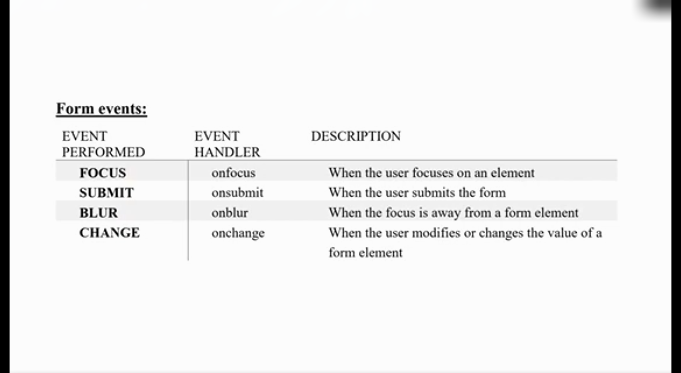
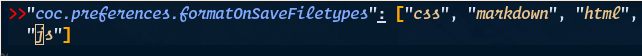

# JavaScript with HTML

We can use js code under `script` tag. This `script` tag could be used inside `head` as well as `body` tag.

## External JavaScript File

* We can create external JavaScript file.
* Embed it in many html pages.
* It provides **code re-usability** because single JavaScript file can be used in several html pages.
* An external JavaScript file must be saved by .js extension
> It is recommended to embed all JavaScript files into a single file. It increases the speed of the webpage.
> See nhtml/practice/js_lecture2 folder for examples.

## Advantages of External JavaScript
* It helps in the reusability of code in more than one HTML file.
* It allows easy code readability.
* It is time-effiecient as web browsers cache the external js files,
	which further reduces the page loading time.
* It enables both web designers and coders to work with html and js files parallelly and separately i.e., without facing any code confilictions
* The length of the code  reduces as only we need to specify the location of the js file.

## Disadvantages of External JavaScript
* If two js files are dependent on one another, then a failure in one file may affect the execution of the other dependent file.
* The web browser needs to make an additional http request to get the js code.
* A tiny to a large change in the js code may cause unexpected results in all its dependent files.
* We need to check each file that depends on the commonly created external JavaScript file.
* If it is a few lines of code then better to implement the internal JavaScript code.

## Variables in Java Script

A `JavaScript variable` is simply a name of storage location. `var` keyword is used to declare variable. Example:
```javascript
var x = 10
var y = 20
var z = x+y;
```
### Rules:
* Name must start with a letter *a to z or A to Z, underscore(_) or dollar($)* sign.
* After first letter we can use digits (0 to 9), for example `value1`.
* JavaScript variables are case sensitive, for example x and X are different variables.

## Local and Global Variables in JS:

### Local
* A JavaScript local variable is declared inside block or function.
* It is accessible within the function or block only.
* Preference of local variable is high.
### Global
* A JavaScript global variable is declared outside of block or function.
* It is accessible within or outside the function or block.
* Preference of global variable is low.

**Example:**
```html
<script>
var data=200; // global variable
function a() {
	document.writeln("inside a"+data+"<br>");
}
function b(){
var data=250; // local variable
document.writeln("inside b"+data);
}
a();	// calling JavaScript function
b();
</script>
```
## JavaScript Data Types:

JavaScript provides different data types to hold different types of values.

### Primitive data type
This type could not be further converted into more composite form.
* **String** represents sequence of characters e.g., "hello"
* **Number** represents numeric values e.g. 100
* **Boolean** represents boolean value either false or true
* **Undefined** represents undefined value
* **Null** represents null i.e. no value at all

### Non-primitive (reference) data type
* **Object** represents instance through which we can access members
* **Array** represents group of similar values
* **RegExp** represents regular expression

## Operators in JavaScript

* Airthmetic Operators
	+ \+
	+ \-
	+ \*
	+ /
	+ %
	+ ++
	+ --
* Comparison (Relational) Operators
	+ == (is equal to)
	+ === (identical(equal and of same type))
	+ != (not equal to)
	+ !== (not identical)
	+ \>
	+ \>=
	+ <
* Bitwise Operators
	+ &
	+ |
	+ ^
	+ ~
* Logical Operators
* Assignment Operators
	+ =
	+ +=
	+ -=
	+ *=
	+ /=
	+ %=
* Special Operators
	+ (?;)
	+ ,
	+ DELETE
	+ new

## Conditional Statements

Check this example:
```javascript
var age = prompt("Please enter your age");
if (age >= 18)
	document.write("You're an adult <br/>");
else
	document.write("You're NOT an adult <br/>")
```

## Loop in Java Script

### for loop
The for loop is used when you know in advance how many times the script should run.
**Syntax:**
```javascript
for (var = startvalue; var <= endvalue; var = var + increment) {
	code to be executed
}
```

### while loop
Loop execute a block of code a specified number of times or while a specified condition is true.
**Syntax:**
```javascript
while (var <= endvalue) {
	code to be executed
}
```

### do...while loop
The do...while loop is a variant of the while loop. This loop will execute the block of code _ONCE_, and then it will repeat the loop as long as the specified condition is true.
**Syntax:**
```javascript
do {
	code to executed;
} while (var <= endvalue);
```

### for...in statement
The for...in statement loops through the elements of an array or through the properties of an object.

**Syntax:**
```javascript
for (variable in object) {
	code to be executed
}
```
* The code in the body of the for...in loop is executed once for each element/property.
* The variable argument can be a named variable, an array element, or a property of an object.
**Example:** Use the for...in statement to loop through an array.

## JavaScript Popup Boxes
JavaScript has three kind of popup boxes: Alert box, Confirm box and Prompt box.

### Alert Box

An alert box is often used if you want to make sure information comes through to the user.

When an alert box popes up, the user will have to click `OK` to proceed.
```javascript
alert("some text");
```

### Confirm Box
A confirm box is often used if you want the user to verify or accept something. When a confirm box pops up, the user will have to click either `OK` or `Cancel` to proceed. If the user clicks `OK`, the box returns false.
**Syntax:**
```javascript
confirm("Some text");
```

### Prompt Box
A prompt box is often used if you want the user to input a value before entering a page.

When a prompt box pops up, the user will have to click either `OK` or `Cancel` to proceed after entering an input value.

If the user clicks `OK` the box returns the input value. If the user clicks `Cancel` the box returns `null`.
**Syntax:**
```javascript
prompt("sometext", "Default Value");
```

## JavaScript Events
The change in the state of an object is known as an **Event**. In html, there are various events which represents that some activity is performed by the user or by the browser. When javascript code is included in HTML, js react over these events and allow the execution. This process of reacting over the events is called **Event Handling**. Thus, js handles the HTML events via **Event Handlers**.

**For example,** when a user clicks over the browser, add js code, which will execute the task to be performed on the event. Some of the HTML events and their event handlers are shown in figure below:

**Mouse Events:**


**Form Events:**


**Window/Document Events:**

## Array in JavaScript
JavaScript array is an object that represents a collection of similar type of elements.

We can create Array in JavaScript by following way:-
1. By array literal
2. By creating instance of array directly(using new keyword)

### Creating array in JavaScript by literal

The syntax of creating array using array literal is:
**Syntax:**
```javascript
var arrayname=[value1, value2,...valueN];
```
> Note: As you can see, values are contained inside [ ] and separated by comma(,)

## JavaScript Objects
Objects is anything which occupies `space` and we can identify them with their _attributes_ and _behaviour_.

### JavaScript string object
The **JavaScript string** is an object that represents a sequence of characters.
There are two ways to create a string in JavaScript.
* By string literal
* By string object(using new keyword)

<b><i>String by literal</i></b>:-
	<u>The string literal is created using double quotes</u>

**Syntax:**
```javascript
var stringname="string value";

<script>
var str = "This is string literal";
document.write(str);
</script>
```

<u><b>The string literal is created by string object(using new keyword)</b></u>
**Syntax:**

```javascript
var stringname=new String("string literal");
```

### JavaScript String Methods:
* charAt(index)
* concat(str)
* indexOf(str)
* lastIndexOf(str)
* toLowerCase()
* toUpperCase()
* slice(beginIndex, endIndex)

### JavaScript Date Object
The **JavaScript Date Object** is an object that represents a Date. The **JavaScript date** object can be used to get year, month or day.

**methods:**
* getFullYear()
* getMonth()
* getDate()
* getDay()
* getHours()
* getMinutes()
* getSeconds()
* getMiliSeconds()

### JavaScript Math Object
It provides several constants and methods to perform mathematical operation. Unlike date object, it doesn't have constructors.

### Document Object Model
* The **document object** represents the whole html document.
* When html document is loaded in the browser, it becomes a document object.
* It is **root element** that represents the html document.
* It has properties and methods. By the help of document object, we can add dynamic content to our web page.
	> Note: window.document is same as document.
* According to **W3C**, _The W3c Document Object Model (DOM) is a plateform and language-neutral interface that allows programs and scripts to dynamically access and update the content, structure and style of a document._

### Properties of document object


### Methods of document object
* write("string")
* writeln("string")
* getElementById()
* getElementsByName()
* getElementsByTagName()
* getElementsByClassName()

* The **document.getElementById()** method returns the element of specified id.

## Function in JavaScript

A function contains code that will be executed by an event or by a call to the function.
You may call a function from anywhere within a page (or even from other pages if the function is embedded in an external .js file).
Functions can be defined both in the head and in the body section of a document.
However, to assure that a function is read/loaded by the browser before it is called, it could be wise to put functions in head section.

**Syntax:**
```javascript
function function_name(var1, var3, ..., varX) {
	some code
}
```

## The return statement

The return statement is used to specify the value that is returned from the function.
So, functions that are going to return a value must use the return statement.

