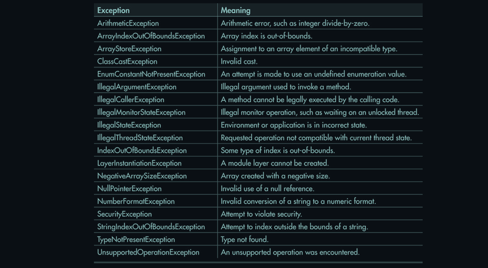
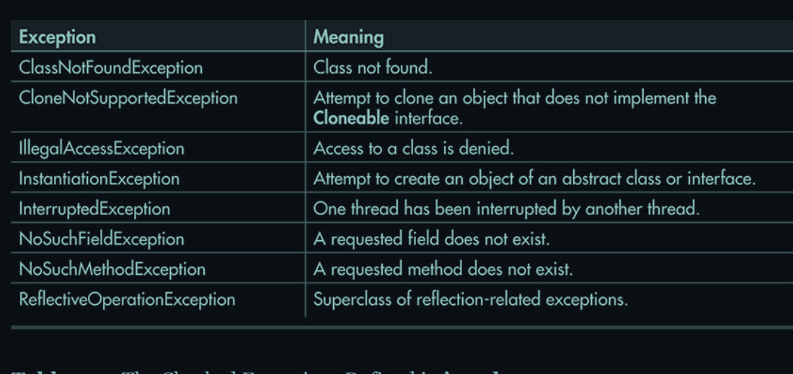
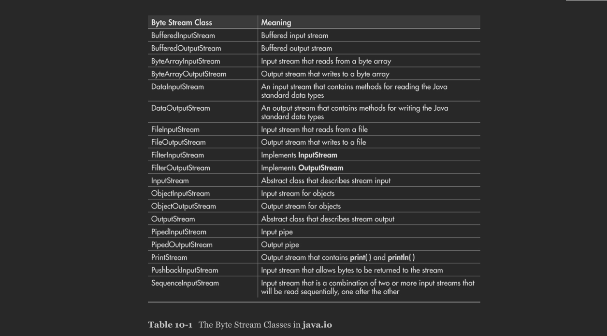

## Access Specifier:

- public
- private
- protected
- default


The top 3 of them are `java keyword`.


### public access specifier:

Usage of `public` with class:
- current class
- another class(exist in current package)
- another class(exist in different package)
- inheritance
- association


### private access specifier

If class is used with `private` keyword then that field/method is only accessible in that same class.


### protected access specifier

If `protected` is used then that class's element is only accessible in current class and current package.


### default access specifier

If `no access specifier` is given then default is considered.


## Modifier:

- static
- final
- abstract
- synchronize

Above are some examples of modifier. Modifier is not mendatory to use.


## Things to check out

A new method to me for taking user input

```java
BufferedReader br = new BufferedReader(new InputStreamReader(System.in));
int x = Integer.parseInt(br.readline());
```

Now, this also says to use excepton handler, so:
```java
try {
	BufferedReader br = new BufferedReader(new InputStreamReader(System.in));
	int x = Integer.parseInt(br.readline());
}
catch(Exception E) {
	System.out.println(E);
}
```

There are two types of inputstream:
- wide stream
- char stream


BufferedReader used `char stream` input stream. But bydefault `wide stream` is used. Just like `System.out` refers std. output buffer. and `System.in` refers std. input buffer which will be bydefault in `wide stream` and then InputStreamReader will covert ths data in `char stream` and then is read in bulk by `BufferedReader`.


### Java lang exception class hierarchy


* Throwable
	+ Error
		- AssertionError
		- LinkageError
			- BootstrapMethodError
			- ClassCircularityError
			- ClassFormatError
				- UnsupportedClassVersionError
			- ExceptionInInitializerError
			- IncompatibleClassChangeError
				- AbstractMethodError
				- IllegalAccessError
				- InstantiationError
				- NoSuchFieldError
				- NoSuchMethodError
			- NoClassDefFoundError
			- UnsatisfiedLinkError
			- VerifyError
		- ThreadDeath
		- VirtualMachineError
			- InternalError
			- OutOfMemoryError
			- StackOverflowError
			- UnknownError
	+ Exception
		- CloneNotSupportedException
		- InterruptedException
		- IOException
			- FileNotFoundException
			- SocketException
				- ConnectException
			- UnknownHostException
		- ReflectiveOperationException
			- ClassNotFoundException
			- IllegalAccessException
			- InstantiationException
			- InvocationTargetException
			- NoSuchFieldException
			- NoSuchMethodException
		- RuntimeException
			- ArithmeticException
			- ArrayStoreException
			- ClassCastException
			- ConcurrentModificationException
			- EnumConstantNotPresentException
			- IllegalArgumentException
				- IllegalThreadStateException
				- NumberFormatException
			- IllegalMonitorStateException
			- IllegalStateException
			- IndexOutOfBoundsException
				- ArrayIndexOutOfBoundsException
				- StringIndexOutOfBoundsException
			- NegativeArraySizeException
			- NullPointerException
			- SecurityException
			- TypeNotPresentException
			- UnsupportedOperationException


## Checked vs. Unchecked Exception:

* **Checked** - are the exceptions that are checked at compile time. If some code within a method throws checked exception, then the method must either handle the exception or it must specify the exception using _throws_ keyword.

_Eg._: _FileNotFoundException_, _IOException_ etc.

* **Unchecked**: are the exceptions that are not checked at compiled time. In C++, all excpetions are unchecked, so it is not forced by compiler to handle or specify exception but in Java that's not the case.

_Eg._: Exceptions under _Error_ and _RuntimeException_ classes are unchecked exceptions. Everything else under _Throwable_ is checked.

See the images, which provides detail about _checked_ and _unchecked_ exception defined by `java.lang`






## A closer look at Throwable

A catch clause specifies an exception type and a parameter. The parameter receives the exception object. Since all exceptions are subclasses of Throwable, all exceptions support the methods defined by Throwable. Several commonly used ones are shown here:


<table>
	<tr>
		<th>Method</th>
		<th>Description</th>
	</tr>
	<tr>
		<td>Throwable fillInStackTrace()</td>
		<td>Returns a <b>Throwable</b> object that contains a completed stack trace. This object can be retrhown.</td>
	</tr>
	<tr>
		<td>String getLocalizedMessage()</td>
		<td>Returns a localized description of the exception</td>
	</tr>
	<tr>
		<td>String getMessage()</td>
		<td>Returns the description of the exception</td>
	</tr>
	<tr>
		<td>void printStackTrace()</td>
		<td>Display the stack trace</td>
	</tr>
	<tr>
		<td>void printStackTrace(PrintStream <i>stream</i>)</td>
		<td>Sends the stack trace to the specified stream</td>
	</tr>
	<tr>
		<td>void printStackTrace(PrintWriter <i>stream</i>)</td>
		<td>Sends the stack trace to the specified stream</td>
	</tr>
	<tr>
		<td>String toString()</td>
		<td>Returns a <b>String</b> object containing a complete description of the exception. This method is called by <b>println()</b> when outputting a <b>Throwable</b> object.</td>
	</tr>
</table>


---

Look for:

* Chained Exceptions


## Java's I/O

Java programs perform I/O through streams. Mainly two types of streams are used in java:
* Byte streams
* Character streams


### Byte Stream and Character Stream

Byte stream provide a conveninet means for handling input and output of bytes. They are used, for example, when reading or writing binary data. They are especially helpful for working with files.

Character streams are designed for handling the input and output of characters. They use Unicode and, therefore, can be internationalized. Also, in some cases, char stream is efficient than byte streams.

One other point: At the lowest level, all I/O is still byte-oriented. The character-based streams simply provide a convenient and efficient means of handling characters.


### The Byte stream Classes

At the top of there are two abstract classes: **InputStream** and **OutputStream**. _InputStream_ defines the characterstics common to byte input streams and _OutputStream_ describes the behaviour of output stream.

Byte Stream classes from **java.io** are shown in the table below:




### The Character Stream Classes

Character streams are defined by using two class hierarchies topped by these two abstract classes: **Reader** and **Writer**. Concrete classes derived from _Reader_ and _Writer_ operate on Unicode character stream. In general character-based classses parallel to byte-based classes.

Character Stream classes from **java.io** are shown in the table below:


### The Predefined Streams

All java programs automatically import `java.lang` package. This package defines a class called **System**, which encapsulates several aspects of the runtime-environment. Among other things, there are three predefined stream variables called **in**, **out** and **err**. These fields are declared as **public**, **final and static** within **System**. This means that they can be used by any other part of your program and without reference to a specific **System** object.

**System.in** is an object of **InputStream**; **System.out** and **System.err** are objects of type **PrintStream**. These are byte streams, even though they are typically used to read and write characters from and to the console. The reason they are byte and not character stream is that thee predefined streams were part of the original specification for Java, which didn't include the character streams.
